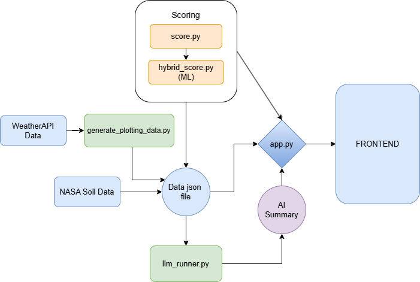

# 🌊 Flood Risk Scoring System (FRSS)

> 🔍 Intelligent flood risk prediction, visualization, and AI-powered reporting for Indian cities.

## 📌 Overview

**FRSS** (Flood Risk Scoring System) is an advanced web-based platform designed to assess and visualize flood risk across 50 Indian cities using real-time weather data, environmental attributes, and hybrid intelligence. It combines the strengths of rule-based heuristics with a trained XGBoost machine learning model to deliver accurate, interpretable flood predictions. 

It also features natural language AI-generated summaries for decision-makers, and interactive dashboards powered by Leaflet.js and Chart.js. FRSS is built with a modular Python-Flask backend and an intuitive JavaScript-based frontend.

---

## 🚀 Features

- 🔄 **Real-Time & Forecasted Weather Integration**  
  Connects to WeatherAPI & NASA POWER APIs to fetch up-to-date rainfall, humidity, temperature, cloud cover, and soil moisture.

- 🧠 **Hybrid Scoring Engine**  
  Combines interpretable rule-based logic with machine learning (XGBoost) for city-specific flood risk classification.

- 🗺️ **Interactive Visualization Dashboards**  
  Nationwide and city-wise dashboards with donut charts, heatmaps, rainfall leaderboards, and radar comparisons.

- 🤖 **AI-Generated Summaries**  
  LLM-powered textual interpretations (via Llama 3.2 3B from Together.ai) of flood trends, risks, and actionable insights.

- 📥 **PDF & Excel Report Exports**  
  Generate downloadable summary reports in professional formats for institutions and policymakers.

---

## 🏗️ System Architecture



---

## 💡 Modules

### 🔧 Backend
- `generate_plotting_data.py` – Builds real-time feature vectors from APIs and static data.
- `hybrid_score.py` – Applies XGBoost and merges with rule-based logic.
- `score.py` – Fully interpretable scoring rules based on environmental thresholds.
- `llm_runner.py` – Connects to the LLM to generate flood summaries.
- `app.py` – Flask controller, API router, data exporter.

### 🎨 Frontend
- `predicts.html` – Input city, see risk score + interactive map.
- `dashboard.html` – Donut + bar charts, rainfall rankings, Leaflet heatmaps.
- `digest.html` – AI-generated markdown summaries with PDF download.
- `plots.html` – Compare cities with radar and risk overlays.

---

## 📊 Model Highlights

| Metric       | Flood (Class 1) |
|--------------|------------------|
| Precision    | 52.6%            |
| Recall       | 62.5%            |
| F1 Score     | 62.5%            |
| ROC-AUC      | 0.82             |
| Accuracy     | ~63.6%           |

> ⚠️ Emphasizes recall to prioritize early flood warnings even at the cost of slight over-prediction.

---

## 📦 Tech Stack

- **Backend:** Python, Flask, XGBoost, joblib
- **Frontend:** HTML, CSS, JS, Chart.js, Leaflet.js, Jinja2
- **APIs:** WeatherAPI, NASA POWER (Soil Moisture)
- **LLM:** Meta’s Llama 3.2 3B via Together.ai
- **PDF & Excel:** pdfkit, pandas

---

## 🛠️ How to Run

1. Clone this repo:
   ```bash
   git clone https://github.com/your-username/frss.git
   cd frss
   ```

2. Set up environment:
   ```bash
   python3 -m venv venv
   source venv/bin/activate
   pip install -r requirements.txt
   ```

3. Add your `WEATHER_API_KEY` and `TOGETHER_API_KEY` to `.env`

4. Run server:
   ```bash
   python app.py
   ```

5. Open in browser: `http://localhost:5000`

---

## 📈 Future Enhancements

- 📱 Mobile app with real-time alerts via push/SMS
- 🌍 GIS overlays using ESRI’s ArcGIS layers
- 📦 Docker containerization for easy deployment
- 🛰️ Satellite feed integration for live flood tracking

---

## 📚 References

- [Kaggle Flood Dataset](https://www.kaggle.com/datasets/s3programmer/flood-risk-in-india)
- [WeatherAPI Docs](https://www.weatherapi.com/)
- [NASA POWER Soil Data](https://power.larc.nasa.gov/)
- [Together.ai LLM API](https://docs.together.ai/)
- [XGBoost Paper (KDD 2016)](https://doi.org/10.1145/2939672.2939785)

---

## 👨‍💻 Author

**Anand Prakash Gupta**  
B.Tech, Computer and Communication Engineering  
Manipal University Jaipur  
👨‍🏫 Supervised by: Dr. Kusum Lata Jain

---

## 📬 Contact

For queries, improvements, or collaborations:  
📧 [your.email@example.com]  
🌐 [LinkedIn](https://linkedin.com/in/your-profile)

---

> 🌧️ Let's outsmart floods, one city at a time.
