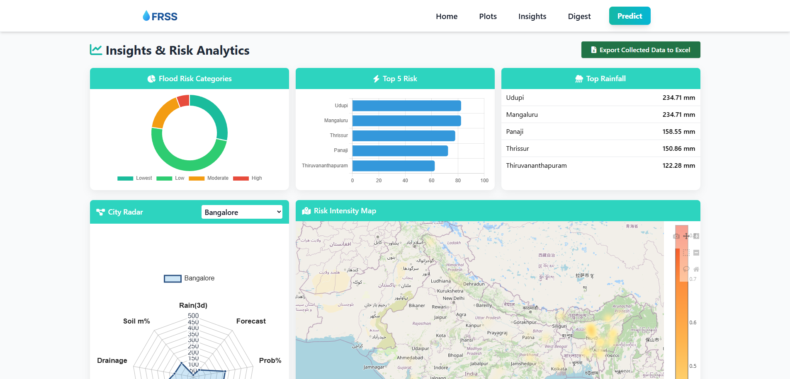
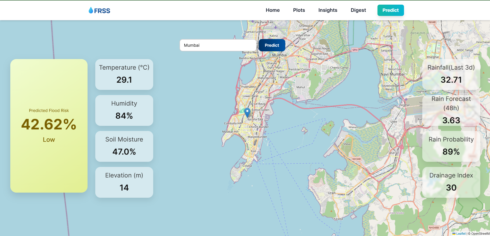
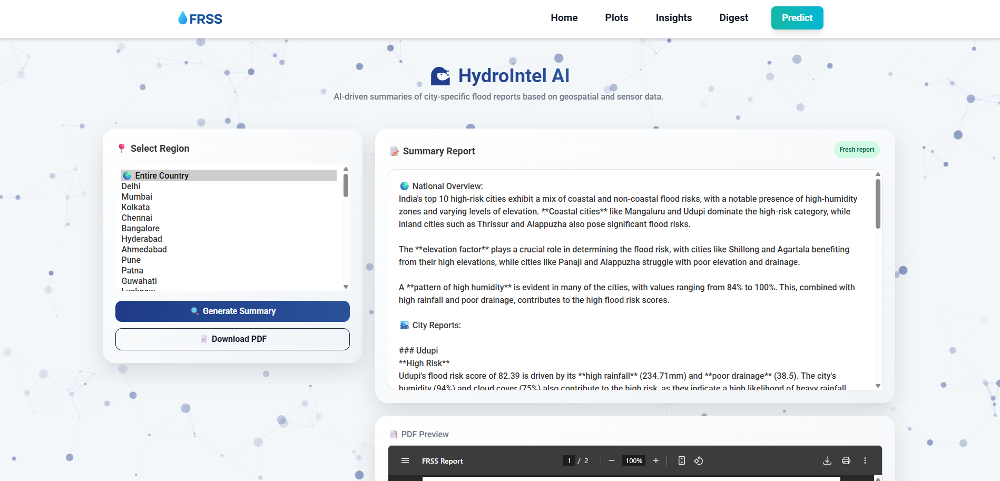
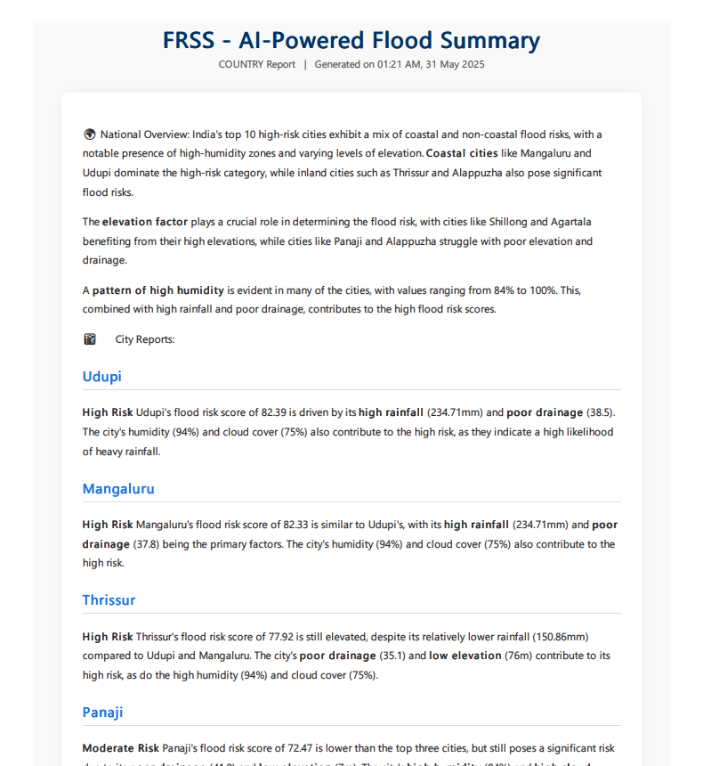

# 🌊 Flood Risk Scoring System (FRSS)

> 🔍 Intelligent flood risk prediction, visualization, and AI-powered reporting for Indian cities.

---

**🌐 Live Project:** [https://frss.onrender.com/](https://frss.onrender.com/)

---

## 📌 Overview

**FRSS** (Flood Risk Scoring System) is an advanced web-based platform designed to assess and visualize flood risk across 50 Indian cities using real-time weather data, environmental attributes, and hybrid intelligence. It combines the strengths of rule-based heuristics with a trained XGBoost machine learning model to deliver accurate, interpretable flood predictions.

It also features natural language AI-generated summaries for decision-makers, and interactive dashboards powered by Leaflet.js and Chart.js. FRSS is built with a modular Python FastAPI backend and a fully responsive, professional frontend styled with Tailwind CSS.

---

## 🚀 Features

- 🔄 **Real-Time & Forecasted Weather Integration**  
  Connects to WeatherAPI & NASA POWER APIs to fetch up-to-date rainfall, humidity, temperature, cloud cover, and soil moisture.

- 🧠 **Hybrid Scoring Engine**  
  Combines interpretable rule-based logic with machine learning (XGBoost) for city-specific flood risk classification.

- 🗺️ **Interactive Visualization Dashboards**  
  Nationwide and city-wise dashboards with donut charts, heatmaps, rainfall leaderboards, and radar comparisons.

- 🤖 **AI-Generated Summaries**  
  LLM-powered textual interpretations (via Llama 3.2 3B from Together.ai) of flood trends, risks, and actionable insights.

- 📥 **PDF Report Exports**  
  Generate downloadable, modern summary reports for institutions and policymakers.

- 📱 **Responsive & Modern UI**  
  Built with Tailwind CSS, mobile-optimized, clean navigation, and advanced UX.

---

## 🏗️ System Architecture

---

## 📦 Tech Stack

- **Backend:** Python, FastAPI, XGBoost, joblib
- **Frontend:** HTML, Tailwind CSS, JS, Chart.js, Leaflet.js, Jinja2
- **APIs:** WeatherAPI, NASA POWER (Soil Moisture)
- **LLM:** Meta’s Llama 3.2 3B via Together.ai
- **PDF:** WeasyPrint (Linux) / pdfkit (Windows)
- **Deployment:** Render, GitHub Actions (data refresh)

---

## 💡 Modules

### Backend
- `generate_plotting_data.py` – Builds real-time feature vectors from APIs and static data.
- `hybrid_score.py` – Applies XGBoost and merges with rule-based logic.
- `score.py` – Fully interpretable scoring rules based on environmental thresholds.
- `llm_runner.py` – Connects to the LLM to generate flood summaries.
- `app.py` – **FastAPI** controller, API router, data exporter.

### Frontend
- `predicts.html` – Input city, see risk score + interactive map.
- `dashboard.html` – Donut + bar charts, rainfall rankings, Leaflet heatmaps.
- `digest.html` – AI-generated markdown summaries with PDF download.
- `plots.html` – Compare cities with radar and risk overlays.
- **All pages:** Responsive, styled with Tailwind CSS.

---

## 📸 Screenshots

### Dashboard

---

### Predict (City Score)

---

### AI Summary

---

### PDF Export

---

## 📊 Model Highlights

| Metric       | Flood (Class 1) |
|--------------|------------------|
| Precision    | 52.6%            |
| Recall       | 62.5%            |
| F1 Score     | 62.5%            |
| ROC-AUC      | 0.82             |
| Accuracy     | ~63.6%           |

> ⚠️ Emphasizes recall to prioritize early flood warnings even at the cost of slight over-prediction.

---

## 👨‍💻 Author

**Anand Prakash Gupta**  
B.Tech, Computer and Communication Engineering  
Manipal University Jaipur  

---

## 📬 Contact

For queries, improvements, or collaborations:  
📧 [career.anandgupta@gmail.com]  
🌐 [LinkedIn](https://www.linkedin.com/in/anand-prakash-gupta/)

---

